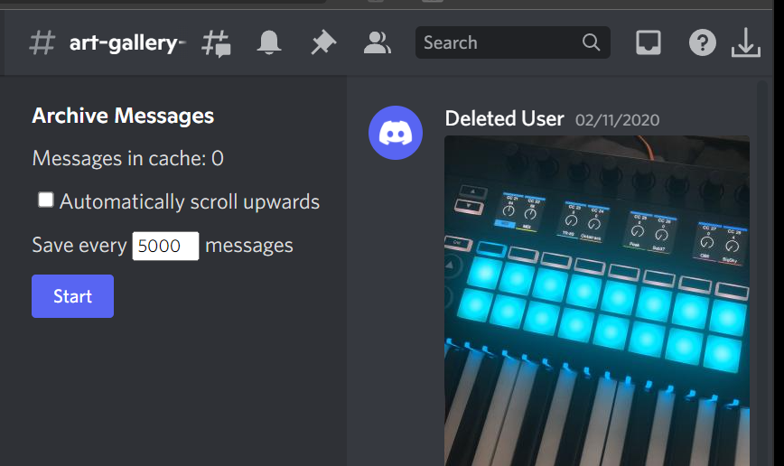

# Discord Message Archiver

This chrome extension facilitates the automatic collection and download of discord message logs, rendered as they would be in Discord's UI.

Features:
 - Unobtrusive UI injected directly into the Discord application
 - Optional automated scrolling through chatlogs
 - Configurable download chunk size between 1000 and 10000 messages (avg about 40mb per 5000 message block)
 - Download of chatlogs in MHTML format with locally stored images
 - Automatic naming of downloads with the date range of archived messages

This extension does NOT (yet):
 - Archive embedded gifs, audio files, or videos
 - Archive raw JSON message contents

If you desire to programmatically manipulate message data, an archiver that qeuries Discord's servers directly and retrieves message contents in JSON may better suit your use case. This extension intends to store messages in a format more suited for casual inspection, hence this approach.

## Licenses

This software is provided under the MIT license

The following libraries have been used:
 - [strftime](https://github.com/samsonjs/strftime) (MIT License)
 - [avltree-js](https://github.com/Wizcorp/avltree-js) (MIT License)

## Screenshots
